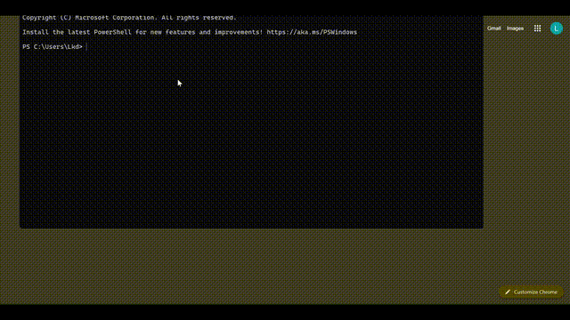

# 🛰️ Satellite tracking System

> A production-grade, open-source SSA platform built entirely with free tools.  
> Orbital mechanics engine · SGP4 propagation · Conjunction detection · REST API · Interactive dashboard

## 🎥 Demo



👉 Full video:  
https://raw.githubusercontent.com/lalit2121/Space-Surveillance-and-Tracking-Dashboard-Space-Situational-Awareness-Project/main/Video%20Project%201.mp4
---

## 📌 Table of Contents

1. [Project Overview](#project-overview)
2. [Architecture](#architecture)
3. [Module Deep-Dives](#module-deep-dives)
   - [orbit_mech_engine.py](#orbit_mech_enginepy)
   - [parser_pipeline.py](#parser_pipelinepy)
   - [conjunction_detection.py](#conjunction_detectionpy)
   - [Analytics.py](#analyticspy)
   - [api_server.py](#api_serverpy)
   - [dashboard.py](#dashboardpy)
4. [Data & Information Flow](#data--information-flow)
5. [contact]

## Project Overview

This Satellite tracking System ingests live Two-Line Element (TLE) sets from [Celestrak](https://celestrak.org/), propagates satellite orbits using a custom SGP4-based engine, performs conjunction detection across the full catalog, and exposes results through both a FastAPI REST layer and a Streamlit interactive dashboard.

**Portfolio motivation:** The system is deliberately built without commercial tools (no STK, no Cesium token required for core functionality) to demonstrate end-to-end aerospace systems engineering in Python.

**Key capabilities:**

- Parses and stores 300+ TLE records in SQLite with BSTAR compressed-exponential decoding
- Propagates orbits via SGP4 with J2 perturbations and atmospheric drag decay
- Detects conjunctions with KDTree pre-screening, TCA refinement via `scipy.optimize`, and Chan 1D collision probability
- Risk thresholds calibrated to NASA CARA / ESA standards (CRITICAL ≥ 1×10⁻⁴)
- Animated 2D ground track map (Plotly Scattergeo) and 3D ECI globe (Three.js r128)
- Full REST API with Swagger UI at `/docs`

---

## Architecture

```
┌─────────────────────────────────────────────────────────────────┐
│                        DATA SOURCES                             │
│              Celestrak TLE feeds (HTTP/JSON)                    │
└────────────────────────────┬────────────────────────────────────┘
                             │
                             ▼
┌─────────────────────────────────────────────────────────────────┐
│                    parser_pipeline.py                           │
│  TLEParser · CelestrackClient · TLEDatabase (SQLite)            │
│  Outputs: TLE dataclass objects, ssa_data.db                    │
└────────────────────────────┬────────────────────────────────────┘
                             │  TLE.to_orbital_element()
                             ▼
┌─────────────────────────────────────────────────────────────────┐
│                   orbit_mech_engine.py                          │
│  OrbitalElement · KeplerSolver · SGP4Propagator                 │
│  CoordinateTransform (ECI ↔ ECEF ↔ Geographic)                 │
│  Outputs: StateVector (r, v, t)                                 │
└──────────┬──────────────────────────────────────────────────────┘
           │ StateVector streams                  │ OrbitalElement
           ▼                                      ▼
┌──────────────────────┐            ┌─────────────────────────────┐
│ conjunction_         │            │       Analytics.py           │
│ detection.py         │            │  OrbitalAnalytics            │
│                      │            │  OrbitalVisualizer (3D/2D)   │
│ ConjunctionDetector  │            │  RiskVisualizer              │
│ ConjunctionSearch    │            │  ExportUtils (CSV/JSON)      │
│ KDTree screening     │            └─────────────────────────────┘
│ TCA refinement       │                          │
│ Chan 1D Pc           │                          │
└──────────┬───────────┘                          │
           │ ConjunctionEvent list                │
           └──────────────────────┬───────────────┘
                                  │
                    ┌─────────────┴──────────────┐
                    │                            │
                    ▼                            ▼
          ┌──────────────────┐       ┌───────────────────┐
          │  api_server.py   │       │   dashboard.py    │
          │  FastAPI/Uvicorn │       │   Streamlit       │
          │  Port 8000       │       │   Port 8501       │
          │  /docs (Swagger) │       │   4 pages         │
          └──────────────────┘       └───────────────────┘
```

**Dependency graph** (import direction):

```
dashboard.py
  └─► Analytics.py
       └─► orbit_mech_engine.py
       └─► parser_pipeline.py
       └─► conjunction_detection.py
            └─► orbit_mech_engine.py

api_server.py
  └─► parser_pipeline.py
  └─► orbit_mech_engine.py
  └─► conjunction_detection.py
  └─► Analytics.py

parser_pipeline.py
  └─► orbit_mech_engine.py   (OrbitalElement)
  └─► sgp4.api               (Satrec — authoritative propagator)
```

> **Rule:** `orbit_mech_engine` has zero internal project imports. It is the foundation layer. Nothing below it.

---

## Module Deep-Dives

---

### `orbit_mech_engine.py`

**Role:** Core astrodynamics library. No framework dependencies — pure Python + NumPy.

#### Data Structures

| Class | Purpose | Key Fields |
|---|---|---|
| `OrbitalElement` | Keplerian elements at epoch | `a` (km), `e`, `i` (rad), `omega`, `Omega`, `M`, `n` (rad/s), `bstar`, `epoch` |
| `StateVector` | ECI Cartesian state | `r` (km, 3-vector), `v` (km/s, 3-vector), `t` (datetime) |

`OrbitalElement` exposes computed properties: `period` (s), `p` (semi-latus rectum), `ra`/`rp` (apogee/perigee radii).

`StateVector` exposes: `altitude` (km above spherical Earth), `velocity_magnitude`, `position_magnitude`.

#### `KeplerSolver`

Solves Kepler's equation `M = E − e·sin(E)` via Newton-Raphson iteration.

- Normalises M to `[−π, π]` before iteration
- Initial guess: `E = M` for low eccentricity, `E = π` for `e ≥ 0.8`
- Convergence tolerance: `1e-8` rad, max 50 iterations
- `anomaly_conversion(M, e)` returns `(E, ν)` — eccentric and true anomaly

#### `CoordinateTransform`

Two static methods used throughout the pipeline:

**`orbital_to_eci(r_orb, oe)`** — applies the three classical rotation matrices:
1. `R_ω` — about Z by argument of perigee
2. `R_i` — about X by inclination  
3. `R_Ω` — about Z by RAAN

Combined as `R = R_Ω @ R_i @ R_ω`.

**`eci_to_geographic(r_eci, t)`** — converts ECI → ECEF via Greenwich Mean Sidereal Time, then ECEF → geodetic (spherical approximation). Returns `(lat°, lon°, alt km)`.

GMST is computed from Julian Day via the standard IAU formula in `_gmst(jd)`. Julian Day is computed by `_julian_day(dt)`.

#### `SGP4Propagator`

Simplified perturbation model. Given an `OrbitalElement` at epoch, propagates to time `t_prop`:

1. Computes `dt = t_prop − epoch` in seconds
2. Advances mean anomaly: `M_prop = M₀ + n·dt`
3. Applies exponential drag decay: `a_prop = a₀ · exp(−B* · dt / 10⁵)`
4. Recalculates `n_prop` from `a_prop` (Kepler's third law)
5. Solves Kepler → `(E, ν)` → orbital frame state `(r_orb, v_orb)`
6. Transforms to ECI via `CoordinateTransform.orbital_to_eci`

> **Note:** For high-fidelity propagation the system delegates to `sgp4.api.Satrec` (via `parser_pipeline.TLE.to_orbital_element()`). The engine's own propagator is used for internal animation and fast screening passes.

---

### `parser_pipeline.py`

**Role:** Ingest → parse → validate → persist TLE data.

#### `TLE` dataclass

Stores raw TLE fields plus parsed orbital elements. Key method:

**`to_orbital_element()`** — delegates to `sgp4.api.Satrec.twoline2rv` for authoritative parsing, then converts `no_kozai` from rad/min to rad/s and derives semi-major axis `a = (μ/n²)^(1/3)`. This is the canonical path from raw TLE text to `OrbitalElement`.

**`epoch` property** — reconstructs `datetime` from TLE's YY + DDD.FFFFFFF format.

#### `TLEParser`

Static parsing methods:

- **`_parse_bstar(s)`** — handles NORAD compressed exponential notation (e.g., `"14296-4"` → `1.4296×10⁻⁴`). Scans right-to-left for the last `+`/`−` sign to split mantissa and exponent.
- **`_parse_mean_motion_ddot(s)`** — same logic for the `n̈` field (positions 44–52 of Line 1).
- **`parse_lines(name, line1, line2)`** — full two-line parser with character-position slicing per the NORAD TLE format spec.

#### `CelestrackClient`

Fetches TLEs from `https://celestrak.org/SOCRATES/query.php` or group endpoints (e.g., `last-30-days`). Returns a list of `TLE` objects.

#### `TLEDatabase`

SQLite wrapper around `ssa_data.db`.

| Method | Description |
|---|---|
| `insert_batch(tles, replace=False)` | Bulk upsert with `INSERT OR REPLACE` |
| `get_all_tles(limit=N)` | Returns list of `TLE` objects |
| `get_tle(norad_id)` | Single-record lookup |
| `count_tles()` | Row count |
| `set_cache / get_cache` | Key-value metadata table for freshness tracking |
| `cache_is_fresh(key, max_age_hours)` | Returns True if cached value is within age limit |

---

### `conjunction_detection.py`

**Role:** Detect and probabilistically score collision risks across the satellite catalog.

This is the most computationally intensive module. It uses a two-phase approach: fast spatial screening followed by precise TCA refinement.

#### `ConjunctionEvent` dataclass

Represents one detected event. Fields: `sat1_id/name`, `sat2_id/name`, `tca` (datetime), `min_distance` (km), `mahalanobis_distance`, `probability_of_collision` ([0,1]), `risk_level` (string), `sat1_hbr/sat2_hbr/combined_hbr` (km).

`to_dict()` produces a JSON-serialisable record for API and export.

#### `HardBodyRadiusModel`

Keyword-based HBR lookup table:

| Class | HBR (km) |
|---|---|
| Starlink | 0.00565 |
| OneWeb | 0.00400 |
| Iridium | 0.00390 |
| CubeSat | 0.00050 |
| Debris | 0.00010 |
| Generic | 0.00300 |

#### `CovarianceModel`

Time-dependent uncertainty model. Position sigma grows linearly with age:
`σ(t) = σ₀ + growth_rate × days`, where `σ₀ = 0.5 km` and `growth_rate = 2.0 km/day`.
Returns a diagonal 3×3 covariance matrix. Velocity covariance uses a separate, smaller growth model.

#### `ConjunctionDetector`

Core detection engine.

**Phase 1 — Grid screening:**  
Propagates all objects over the time horizon at `search_step_hours` resolution. Positions are collected into a matrix and fed into a `scipy.spatial.cKDTree` for O(N log N) candidate pair generation within `initial_screen_km` (default 100 km). Falls back to O(N²) brute force if SciPy is unavailable.

**Phase 2 — TCA refinement:**  
For each candidate pair, uses `scipy.optimize.minimize_scalar` (bounded Brent's method) to find the precise Time of Closest Approach within a ±`refine_window_hours` bracket around the grid minimum.

**Collision Probability:**  
Chan 1D approximation:

```
Pc = (HBR² / 2σ²) × exp(−0.5 × (d/σ)²)
```

where `d` is the miss distance at TCA and `σ` is the combined 1D position uncertainty.

**Risk thresholds** (NASA CARA / ESA calibrated):

| Level | Pc threshold |
|---|---|
| CRITICAL | ≥ 1×10⁻⁴ |
| HIGH | ≥ 1×10⁻⁵ |
| MEDIUM | ≥ 1×10⁻⁶ |
| LOW | ≥ 1×10⁻⁷ |
| NEGLIGIBLE | < 1×10⁻⁷ |

#### `ConjunctionSearch`

Orchestrates catalog-wide search. Supports parallelisation via `concurrent.futures` — either `ProcessPoolExecutor` (default) or `ThreadPoolExecutor`. The `_assess_pair_worker` top-level function enables pickling for multi-process execution.

Results are sorted descending by `probability_of_collision`.

---

### `Analytics.py`

**Role:** Orbital statistics, Plotly visualisations, export utilities.

#### `OrbitalAnalytics`

Stateless static methods for per-object and catalog-level metrics:

- `compute_apogee_perigee(oe)` → `(apogee_alt_km, perigee_alt_km)` above spherical Earth
- `orbital_period_hours(oe)` → period in hours
- `inclination_degrees(oe)` → inclination in degrees
- `catalog_statistics(orbital_elements)` → aggregate dict with min/max/mean/median for apogee, perigee, period, inclination across the full catalog

#### `OrbitalVisualizer`

- `plot_orbits_3d(...)` → Plotly 3D `Scatter3d` with `Surface` Earth sphere. Returns HTML string with embedded Plotly.js CDN.
- `plot_ground_tracks(...)` → Plotly `Scattergeo` on equirectangular projection. Returns HTML string.

Both methods accept a `subset` argument for performance control.

#### `RiskVisualizer`

- `plot_conjunction_timeline(conjunctions)` → scatter plot of Pc vs TCA, colour-coded by risk level
- `plot_risk_matrix(conjunctions)` → horizontal bar chart of top-20 pair risks, log-scaled colour

#### `ExportUtils`

- `export_conjunctions_csv(conjunctions, filepath)` — CSV with all `ConjunctionEvent` fields
- `export_conjunctions_json(conjunctions, filepath)` — JSON array
- `export_statistics_json(stats, filepath)` — catalog statistics JSON

---

### `api_server.py`

**Role:** Production REST API. Built with FastAPI, served by Uvicorn on port 8000.

All responses are typed with Pydantic models. Full Swagger UI at `/docs`, ReDoc at `/redoc`.

#### Endpoints

| Method | Path | Description |
|---|---|---|
| GET | `/` | HTML landing page with endpoint index |
| GET | `/health` | Health check + TLE count |
| GET | `/api/tles` | List TLEs (default limit 100, max 5000) |
| GET | `/api/tle/{norad_id}` | Single TLE record |
| POST | `/api/update-tles` | Trigger background Celestrak fetch |
| GET | `/api/propagate/{norad_id}` | State vector at `hours_ahead` (0–168h) |
| GET | `/api/orbital-elements/{norad_id}` | Computed Keplerian elements |
| GET | `/api/conjunctions` | Catalog-wide conjunction search |
| GET | `/api/conjunction-pair/{id1}/{id2}` | Specific pair risk assessment |
| GET | `/api/statistics` | Aggregate catalog statistics |
| GET | `/api/export/conjunctions` | Download CSV or JSON |

In-memory caches (`_conjunction_cache`, `_analytics_cache`) are available for expensive computations — currently wired but not yet populated across requests.

---

### `dashboard.py`

**Role:** Streamlit multi-page interactive UI. Port 8501.

#### Pages

**Dashboard (Home)**
- Three KPI cards: object count, last update, API status
- Animated 2D ground track map with satellite selector (up to 10 objects). Plotly `Scattergeo` with `mode='text'` emoji markers (`🛰️`) animating across 120 frames over a 6-hour propagation window. Static orbit lines are re-sent in every frame to prevent trace disappearance.
- Telemetry cards per selected satellite (altitude, inclination, period, regime)
- Catalog table (name, NORAD ID, inclination, eccentricity, epoch)
- Inclination histogram

**Three.js 3D Globe**  
An inline Three.js r128 globe (injected via `st.components.v1.html`) featuring:
- Procedural Earth texture with continent polygons
- Specular and atmosphere shading
- Starfield background
- ECI-frame satellite orbits with lerp-based smooth animation
- Telemetry sidebar panel

**Conjunction Analysis**
- User-configurable time horizon, search step, catalog size limit
- Table of detected conjunction events colour-coded by risk level
- Probability of collision formatted in scientific notation

**Analytics**
- Six KPI cards (mean altitude, total objects, LEO/MEO/GEO/HEO counts)
- Six Plotly charts: altitude histogram, inclination histogram, eccentricity histogram, orbital period histogram, altitude vs inclination scatter, altitude vs period scatter

**Data Management**
- Manual TLE fetch trigger
- Database stats display

#### Caching Strategy

`@st.cache_data(ttl=300)` on `load_orbital_elements` and `load_tles` — 5-minute in-memory cache keyed by `db_path`. The `_modules` argument uses the leading-underscore convention to prevent Streamlit from trying to hash the module dict.

---

## Data & Information Flow

```
Celestrak (HTTP)
      │
      │ TLE text (3-line format)
      ▼
CelestrackClient.fetch_group()
      │
      │ List[TLE]
      ▼
TLEDatabase.insert_batch()   ←──── ssa_data.db (SQLite)
      │                                    │
      │ TLE objects                        │ get_all_tles()
      ▼                                    ▼
TLE.to_orbital_element()       OrbitalElement dict
      │                                    │
      │ OrbitalElement                     │
      ▼                                    │
SGP4Propagator.propagate(t)               │
      │                                    │
      │ StateVector(r, v, t)              │
      ▼                                    │
CoordinateTransform.eci_to_geographic()   │
      │                                    │
      │ (lat, lon, alt)                   │
      ▼                                    ▼
dashboard.py  ←─────────────── Analytics.py ──► ExportUtils
api_server.py ←─────── conjunction_detection.py
```

**Units contract** (critical — prior bug source):

| Quantity | Internal unit | Note |
|---|---|---|
| `n` (mean motion) in `OrbitalElement` | rad/s | `sgp4` returns `no_kozai` in rad/min — always divide by 60 |
| Positions `r` | km | ECI frame |
| Velocities `v` | km/s | ECI frame |
| Inclination in `OrbitalElement` | radians | Converted to degrees only in API responses and display |
| Inclination in `TLE` dataclass | degrees | Raw from TLE Line 2 |

##contact


-for any kind of suggestion/feedback feel free to contact me on lalit2deshmukh@gmail.com. 
